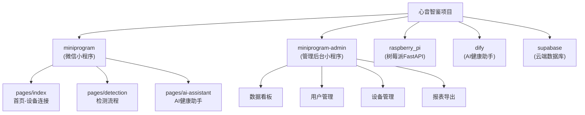

# 心音智鉴 (HeartSound) - AI上下文文档

> 最后更新: 2026-01-23 23:35:41

---

## 项目愿景

心音智鉴是一款基于AI的心音检测微信小程序，通过树莓派边缘设备采集心音数据，结合深度学习模型进行实时分析，为家庭用户提供便捷的心脏健康自检服务。

**核心价值主张**:
- 家庭级心音采集与智能分析
- 边缘计算，本地AI推理，保护隐私
- 云端数据存储，支持长期健康追踪
- AI健康助手，提供个性化健康建议

---

## 项目状态

| 状态项 | 当前状态 |
|--------|----------|
| 项目阶段 | 设计规划阶段 |
| 代码实现 | 尚未开始 |
| 设计文档 | 已完成 |
| 原型/UI稿 | 待确认 |

---

## 架构总览

```
+-------------------+     +-------------------+     +-------------------+
|   微信小程序       |     |   树莓派边缘设备   |     |   云端服务         |
|   (用户界面)       | <-> |   (FastAPI)       | --> |   (Supabase)      |
+-------------------+     +-------------------+     +-------------------+
        |                         |                         |
        v                         v                         v
   - 设备连接              - 心音采集                 - 用户数据
   - 检测流程              - AI推理                   - 检测记录
   - 结果展示              - WebSocket推流            - 健康档案
   - 健康档案              - 二维码生成               - 认证服务
        |
        v
+-------------------+
|   Dify AI平台     |
|   (Docker自托管)   |
+-------------------+
   - 健康问答助手
   - 智能报告生成
```

---

## 模块结构图



---

## 模块索引

| 模块 | 路径（规划） | 技术栈 | 职责 | 状态 |
|------|-------------|--------|------|------|
| 微信小程序 | `miniprogram/` | WXML + WXSS + JS | 用户端界面与交互 | 待开发 |
| 管理后台 | `miniprogram-admin/` | WXML + WXSS + JS | 管理员数据管理 | 待开发 |
| 树莓派后端 | `raspberry_pi/` | FastAPI + Python 3.11 | 心音采集与AI推理 | 待开发 |
| Dify AI平台 | Docker自托管 | Dify + DeepSeek | 健康问答与报告生成 | 待部署 |
| 云端数据库 | Supabase | PostgreSQL | 数据持久化与认证 | 待配置 |

---

## 核心功能模块

### 1. 首页模块 - 设备连接
- 扫码连接（二维码格式: `heartsound://connect?ip={IP}`）
- 手动输入IP连接
- 设备状态卡片（未连接/已连接/断开）
- 心跳检测（10秒间隔）

### 2. 检测中心模块
- **准备页**: 听诊器放置引导
- **录制页**: 30秒心音采集，实时波形显示
- **分析页**: AI推理加载动画
- **结果页**: 风险分级展示（安全/中等/高风险）

### 3. AI健康助手模块
- 健康问答Bot（Dify Chatflow）
- 智能报告生成（Dify Workflow）
- 个性化健康建议

### 4. 管理员后台
- 数据看板（检测统计、趋势图表）
- 用户管理（列表、详情、检测记录）
- 设备管理（分配、状态监控）
- 报表导出（Excel/CSV）

---

## 数据模型概览

### 核心数据表

| 表名 | 用途 |
|------|------|
| `users` | 用户信息（openid、昵称、头像） |
| `devices` | 设备信息（设备ID、固件版本、模型版本） |
| `user_devices` | 用户设备绑定关系 |
| `detection_records` | 检测记录（结果、置信度、风险等级、概率分布） |
| `health_tips` | 健康小贴士 |
| `admins` | 管理员账户 |
| `admin_logs` | 管理操作日志 |
| `ai_reports` | AI生成的健康报告 |

---

## API设计概览

### 树莓派端API（FastAPI）

| 端点 | 方法 | 用途 |
|------|------|------|
| `/api/device/info` | GET | 获取设备信息 |
| `/api/device/ping` | GET | 心跳检测 |
| `/api/detection/start` | POST | 开始检测 |
| `/api/detection/{session_id}/result` | GET | 获取检测结果 |
| `/ws/audio/{session_id}` | WebSocket | 音频流推送 |

### 管理后台API

| 端点 | 方法 | 用途 |
|------|------|------|
| `/api/admin/dashboard/summary` | GET | 看板数据 |
| `/api/admin/users` | GET | 用户列表 |
| `/api/admin/devices` | GET | 设备列表 |
| `/api/admin/devices/{id}/assign` | POST | 设备分配 |
| `/api/admin/reports/generate` | POST | 生成报表 |

---

## 运行与开发

### 开发环境要求

| 组件 | 版本要求 |
|------|----------|
| 微信开发者工具 | 最新稳定版 |
| Node.js | 18+ |
| Python | 3.11+ |
| Docker | 24+ |

### 规划的开发步骤

1. **阶段一**: 搭建Supabase项目，创建数据库表
2. **阶段二**: 开发树莓派FastAPI后端
3. **阶段三**: 开发微信小程序用户端
4. **阶段四**: 开发管理后台小程序
5. **阶段五**: 部署Dify平台，配置AI健康助手

---

## 设计规范

### 颜色规范

| 类型 | 色值 | 用途 |
|------|------|------|
| 主色-品牌蓝 | #1890FF | 按钮、波形、强调 |
| 安全色-绿 | #4CAF50 | 正常结果 |
| 警告色-黄 | #FF9800 | 中等风险 |
| 危险色-红 | #F44336 | 高风险 |
| 主文字 | #333333 | 标题 |
| 次文字 | #666666 | 正文 |
| 辅助文字 | #999999 | 提示 |

### 字体规范

| 层级 | 字号 | 用途 |
|------|------|------|
| Display | 72px Bold | 倒计时数字 |
| H1 | 24px Bold | 结果状态 |
| H2 | 18px Medium | 卡片标题 |
| Body | 14px Regular | 正文说明 |
| Caption | 12px Regular | 辅助标签 |

---

## 性能指标

| 指标 | 目标值 |
|------|--------|
| 波形渲染帧率 | >= 30fps |
| 页面切换时间 | <= 300ms |
| WebSocket连接 | <= 2秒 |
| AI推理时间 | <= 5秒 |
| 整体流程耗时 | <= 50秒 |

---

## AI使用指引

### 开发此项目时的注意事项

1. **设计文档优先**: 当前项目仅有设计文档，开发时应严格参考 `心音智鉴检测中心功能设计方案.md`
2. **技术栈选择**:
   - 小程序使用原生开发（非Taro/UniApp）
   - 后端使用FastAPI（非Flask/Django）
   - 数据库使用Supabase（非自建PostgreSQL）
3. **安全考虑**:
   - 启用Supabase RLS策略
   - 敏感数据脱敏处理
   - 医疗免责声明必须包含
4. **AI功能限制**:
   - 健康问答不做诊断性结论
   - 所有AI回复包含免责声明

### 相关文件

| 文件 | 路径 | 用途 |
|------|------|------|
| 功能设计方案 | `心音智鉴检测中心功能设计方案.md` | 完整功能设计与技术架构 |
| 功能设计方案(PDF) | `心音智鉴检测中心功能设计方案.pdf` | PDF版本 |

---

## 变更记录 (Changelog)

| 日期 | 变更内容 | 操作者 |
|------|----------|--------|
| 2026-01-23 | 初始化CLAUDE.md，基于设计文档生成 | AI |

---

*本文档由AI自动生成，基于项目设计文档分析。项目当前处于设计阶段，尚未开始实际开发。*
